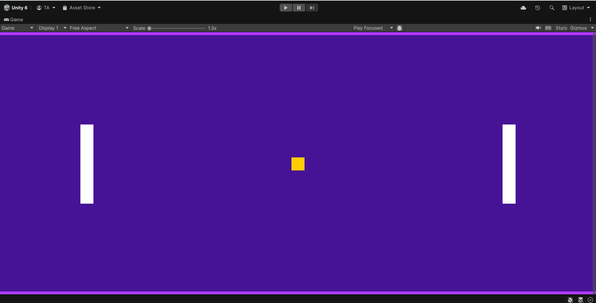

# Unity Pong Game (2D)



A simple, physics-based 2D Pong game made with **Unity** and **C#**. Two players control paddles to bounce the ball back and forth. The game features realistic collisions using Unity’s 2D physics system, and the ball speeds up with every paddle hit, making the game progressively more challenging.

---

## Built With

- **Unity Engine** (2D Project)
- **C# Scripting**
- **Physics Material 2D** for elastic ball behavior

---

## Project Structure (Scene)

- Main Camera

- Player1

- Player2

- Ball

- LeftWall (score trigger for Player 2)

- RightWall (score trigger for Player 1)


---

## Features

- 2-player local multiplayer (keyboard controlled)
- Randomized ball direction on start
- Ball **increases speed after each paddle collision**
- Elastic, high-bounce collisions using physics material
- Win detection when ball hits left or right wall
- Minimalist layout and simple controls

---

## Controls

| Player | Controls |
|--------|----------|
| Player 1 | `W` (Up), `S` (Down) |
| Player 2 | `VerticalPlayer2` axis (suggested: Up / Down Arrows) |

> Make sure you add a new Input Axis named `VerticalPlayer2` via `Edit → Project Settings → Input Manager`.

---

## Game Logic

### BallController.cs
- Random initial velocity on start.
- Collision with paddle increases speed:
```csharp
rgb.linearVelocity = rgb.linearVelocity.normalized * (rgb.linearVelocity.magnitude + speedIncreaseRate);
```

Triggers game end via wall collisions (LeftWall / RightWall).


### PlayerController.cs

Simple vertical movement using input axes.

Separate control logic for Player 1 and Player 2.


